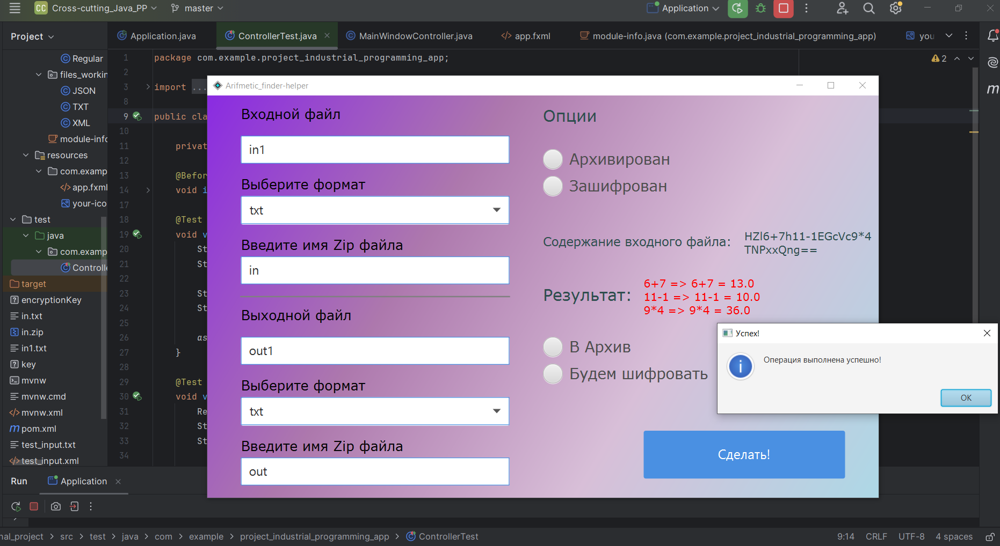

## Задача
Создать web-service, который красиво читает данные из входного файла, обрабатывает их тремя способами(без и с регулярными выражениями; 
со сторонней библеотекой) и записывает в выходной файл(формата на выбор). Может обрабатывать заархивированные и зашифрованные файлы.
Цель проекта- познакомиться с многи аспектами промышленного программирования, поэтому я сделал также ещё и реализацию предзагрузчика страницы. Для тренировки :)

### Возможности проекта:
1. Чтение файла (txt/json/xml/zip)
2. Извлечение из архива файла (поддерживаемые форматы zip)
3. Нахождение и обработка математических выражений 
4. Архивация выходного файла
5. Запись вычисленных математических выражений в файл
6. Шифрование/дешифрование файла
7. Использование сайта/оконного/консольного интерфейса
8. Добавление пользовательских функций включения музыки на фон

## Используемые технологии и паттерны:
##1. Builder (Строитель)
Где применён:

Вы описали, что приложение работает с различными форматами файлов (TXT, XML, JSON, YAML) и поддерживает разные комбинации архивации и шифрования.
Признаки использования:
Builder применяется для создания сложных объектов поэтапно, особенно если объект может быть собран в нескольких конфигурациях.
Например, обработка входных/выходных файлов с разными параметрами (шифрование, архивация) и форматов может быть реализована через Builder.
##2. Decorator (Декоратор)
Где применён:

Реализация функционала архивации и шифрования.
Признаки использования:
Decorator позволяет добавлять новую функциональность объекту без изменения его кода.
Если у вас есть базовый объект (например, обработчик файла) и вы добавляете к нему шифрование или архивацию, это может быть реализовано через цепочку декораторов.
##3. Strategy (Стратегия)
Где применён:

Для обработки математических выражений или работы с различными форматами файлов.
Признаки использования:
Strategy позволяет определить семейство алгоритмов (например, парсинг TXT, XML, JSON) и выбирать подходящий алгоритм на основе типа данных.
##4. Factory Method (Фабричный метод)
Где применён:

В обработке различных типов файлов.
Признаки использования:
Если вы используете общий интерфейс для работы с файлами разных форматов и создаёте конкретный обработчик (например, TxtHandler, JsonHandler, XmlHandler) через фабрику, это пример фабричного метода.
##5. Singleton (Одиночка)
Где применён:

Возможно, для хранения глобальных параметров приложения, таких как настройки (выбранные форматы, пути файлов и т. д.).
Признаки использования:
Если у вас есть класс, создающий только один экземпляр для управления глобальным состоянием, это Singleton.
##6. MVC (Model-View-Controller)
Где применён:

Архитектура приложения, основанная на JavaFX, явно разделяет данные (Model), интерфейс (View) и логику (Controller).
Признаки использования:
FXML-файлы для описания интерфейса (View).
Controller для обработки действий пользователя.
Логика и обработка данных вынесены в отдельные классы.
##7. Observer (Наблюдатель)
Где применён:

В обработке событий интерфейса.
Признаки использования:
Если интерфейс реагирует на события (например, нажатие кнопок), это может быть частью механизма Observer.
##Итог
Использовали следующие паттерны:

Builder
Decorator
Strategy
Factory Method
Singleton
MVC
Observer
##Эти паттерны делают код гибким, модульным и легко расширяемы

## Материалы:
- "Чистая архитектура: принципы дизайна"
- "Экстремальное программирование"
- "Паттерны объектно-ориентированного проектирования"
- "Философия Java"
- "Unit Testing- 2020"
- "Объектно-Ориентированный анализ и проектирование"(Гради Буч)
  

